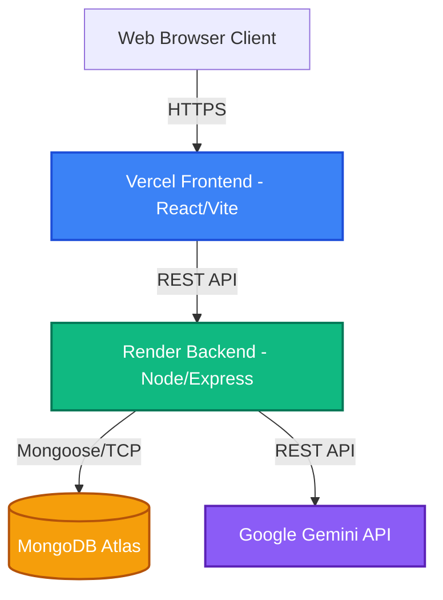

# TechNova System Architecture

## Overview
This diagram illustrates the high-level architecture of the TechNova platform. It maps out how the user interacts with the system, and how the various distributed cloud services communicate with each other.

## How it works:
1. **Client Interaction**: Users interact with the React-based frontend hosted on Vercel's Edge Network, ensuring fast static delivery.
2. **API Requests**: The frontend sends REST API calls to the Express backend hosted on Render.
3. **Data Persistence**: The backend connects to MongoDB Atlas using Mongoose to read and write application state (users, history, logs).
4. **AI Generation**: For heavy lifting (Content, Code, Image generation), the backend securely proxies requests to the Google Gemini API.

