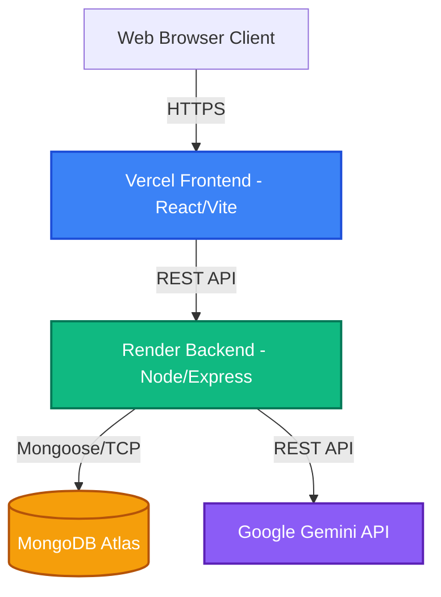

# TechNova System Architecture

This diagram illustrates the high-level architecture of the TechNova platform, showing how the frontend, backend, database, and external APIs interact.

```mermaid
graph TD
    Client[Web Browser Client] -->|HTTPS| Frontend[Vercel Frontend - React/Vite]
    Frontend -->|REST API| Backend[Render Backend - Node/Express]
    Backend -->|Mongoose/TCP| DB[(MongoDB Atlas)]
    Backend -->|REST API| Gemini[Google Gemini API]
    
    classDef frontend fill:#3b82f6,stroke:#1d4ed8,stroke-width:2px,color:#fff;
    classDef backend fill:#10b981,stroke:#047857,stroke-width:2px,color:#fff;
    classDef db fill:#f59e0b,stroke:#b45309,stroke-width:2px,color:#fff;
    classDef external fill:#8b5cf6,stroke:#5b21b6,stroke-width:2px,color:#fff;
    
    class Frontend frontend;
    class Backend backend;
    class DB db;
    class Gemini external;
```
