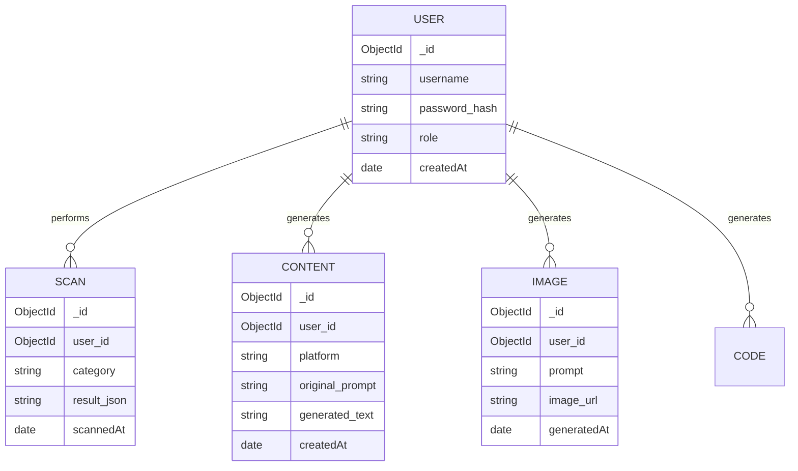

# Database Schema (ERD)

## Overview
This Entity-Relationship Diagram (ERD) shows the MongoDB document collections and their relationships. Since MongoDB is NoSQL, these relationships are maintained via `ObjectId` references.

## How it works:
- **USER Collection**: The central entity containing authentication data (hashed passwords) and roles.
- **Relational Data**: Every action performed on the platform (SCAN, CONTENT, IMAGE, CODE) is tied to the `user_id`.
- **History Tracking**: By linking generations to the user, the platform can fetch and display a comprehensive history dashboard for the admin.

