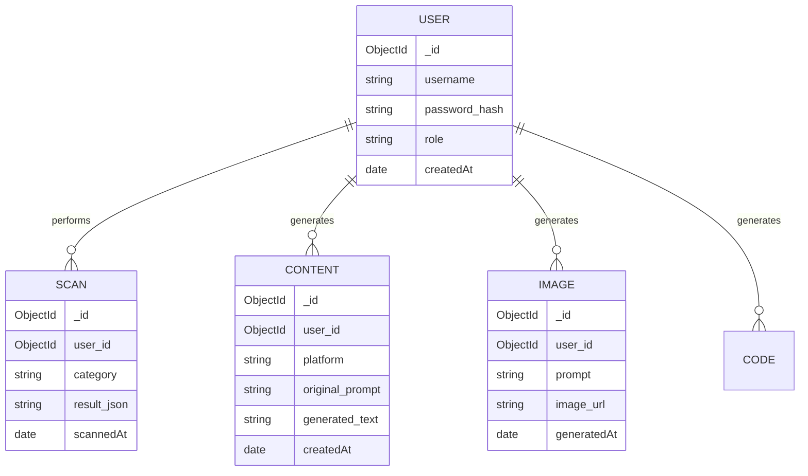

# Database Schema (ERD)

This diagram shows the MongoDB document collections and their relationships.

```mermaid
erDiagram
    USER ||--o{ SCAN : "performs"
    USER ||--o{ CONTENT : "generates"
    USER ||--o{ IMAGE : "generates"
    USER ||--o{ CODE : "generates"

    USER {
        ObjectId _id
        string username
        string password_hash
        string role
        date createdAt
    }
    
    SCAN {
        ObjectId _id
        ObjectId user_id
        string category
        string result_json
        date scannedAt
    }
    
    CONTENT {
        ObjectId _id
        ObjectId user_id
        string platform
        string original_prompt
        string generated_text
        date createdAt
    }
    
    IMAGE {
        ObjectId _id
        ObjectId user_id
        string prompt
        string image_url
        date generatedAt
    }
```
