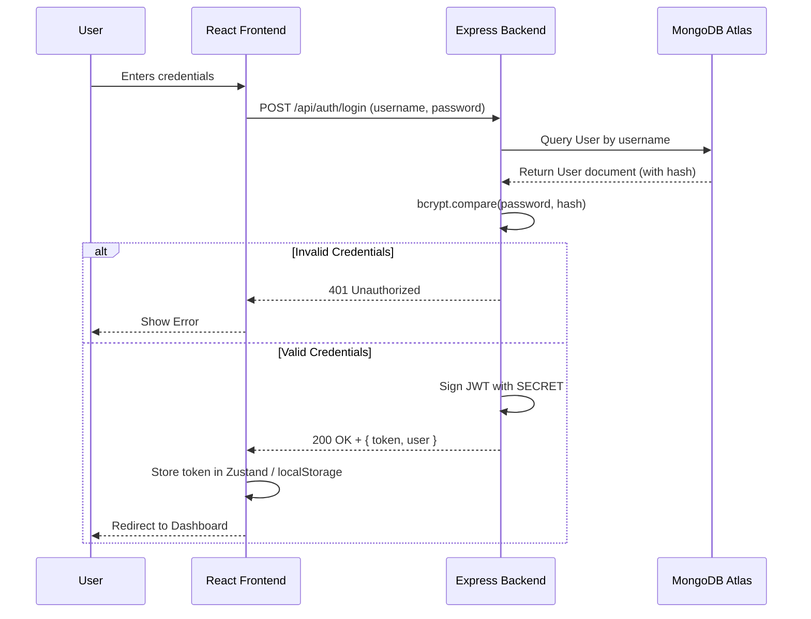

# Authentication Flow

## Overview
Detailed flow of how JSON Web Token (JWT) authentication is handled between the client and server.

## How it works:
1. The user provides a username and password on the frontend.
2. The Node.js API queries the database for the user.
3. `bcrypt.compare` is used to securely check the entered password against the hashed database value.
4. If valid, a JWT token is signed using a secret key and returned to the client.
5. The frontend stores this token (e.g., using Zustand state) and attaches it as a `Bearer` token in the `Authorization` header for all subsequent protected API requests.

