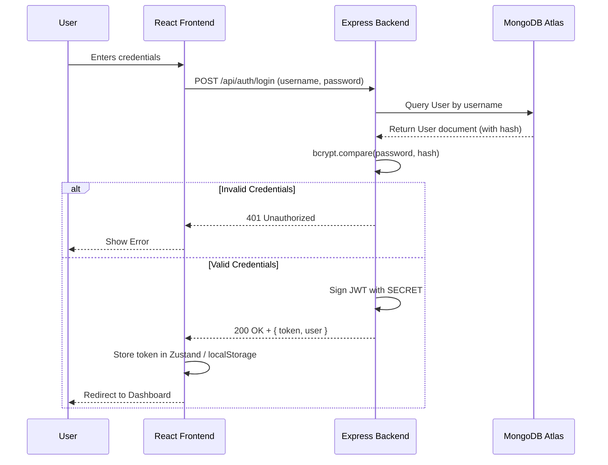

# Authentication Flow

Detailed flow of how JWT authentication is handled between the client and server.

```mermaid
sequenceDiagram
    participant User
    participant Client as React Frontend
    participant API as Express Backend
    participant DB as MongoDB Atlas

    User->>Client: Enters credentials
    Client->>API: POST /api/auth/login (username, password)
    API->>DB: Query User by username
    DB-->>API: Return User document (with hash)
    API->>API: bcrypt.compare(password, hash)
    alt Invalid Credentials
        API-->>Client: 401 Unauthorized
        Client-->>User: Show Error
    else Valid Credentials
        API->>API: Sign JWT with SECRET
        API-->>Client: 200 OK + { token, user }
        Client->>Client: Store token in Zustand / localStorage
        Client-->>User: Redirect to Dashboard
    end
```
