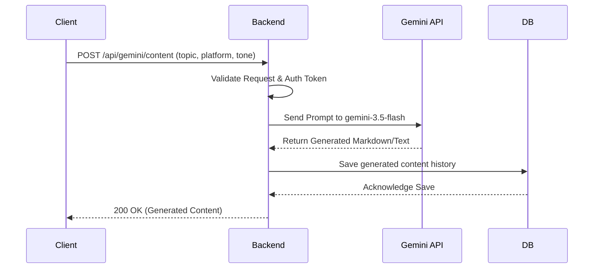

# AI Content Generation Flow

Process of generating platform-specific content using Gemini API.

```mermaid
sequenceDiagram
    participant Client
    participant Backend
    participant Gemini API
    participant DB

    Client->>Backend: POST /api/gemini/content (topic, platform, tone)
    Backend->>Backend: Validate Request & Auth Token
    Backend->>Gemini API: Send Prompt to gemini-3.5-flash
    Gemini API-->>Backend: Return Generated Markdown/Text
    Backend->>DB: Save generated content history
    DB-->>Backend: Acknowledge Save
    Backend-->>Client: 200 OK (Generated Content)
```
