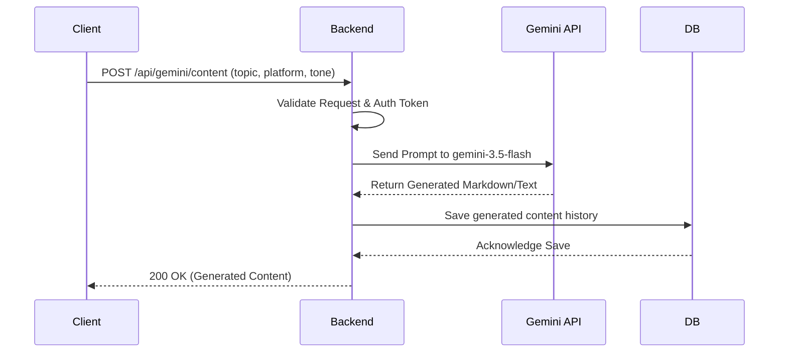

# AI Content Generation Flow

## Overview
Process of generating platform-specific social media content using the Google Gemini API.

## How it works:
1. The user fills out a form specifying a topic, target platform (e.g., Twitter, LinkedIn), and desired tone.
2. The backend intercepts this request, validates the JWT auth token, and constructs a highly specific prompt.
3. The prompt is sent to the `gemini-3.5-flash` text model.
4. Once Gemini returns the formatted markdown text, the backend saves the result in the `CONTENT` collection in MongoDB for historical tracking.
5. The response is forwarded to the frontend, where it is rendered beautifully.

