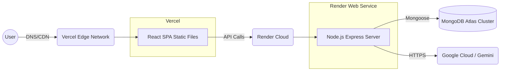

# Deployment Architecture

Infrastructure setup for TechNova across multiple cloud providers.

```mermaid
flowchart LR
    User((User)) -->|DNS/CDN| Vercel(Vercel Edge Network)
    
    subgraph Frontend Hosting [Vercel]
        ReactApp[React SPA Static Files]
    end
    
    Vercel --> ReactApp
    
    ReactApp -->|API Calls| Render(Render Cloud)
    
    subgraph Backend Hosting [Render Web Service]
        NodeApp[Node.js Express Server]
    end
    
    Render --> NodeApp
    
    NodeApp -->|Mongoose| MongoDB[(MongoDB Atlas Cluster)]
    NodeApp -->|HTTPS| GoogleAI(Google Cloud / Gemini)
```
