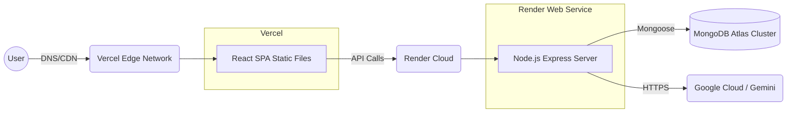

# Deployment Architecture

## Overview
Infrastructure setup for TechNova distributed across multiple cloud providers for maximum free-tier efficiency.

## How it works:
- **Vercel**: Handles the React SPA (Single Page Application). It serves static assets globally via its CDN edge network, ensuring blazing-fast load times.
- **Render**: Hosts the Express Node.js backend. Render is chosen because it supports long-running processes, which are necessary for heavy API tasks and WebSockets (if added later).
- **MongoDB Atlas**: A cloud-managed database service that stores the application's persistent state.
- **Google Cloud**: Provides the Gemini API endpoints used for generative AI capabilities.

