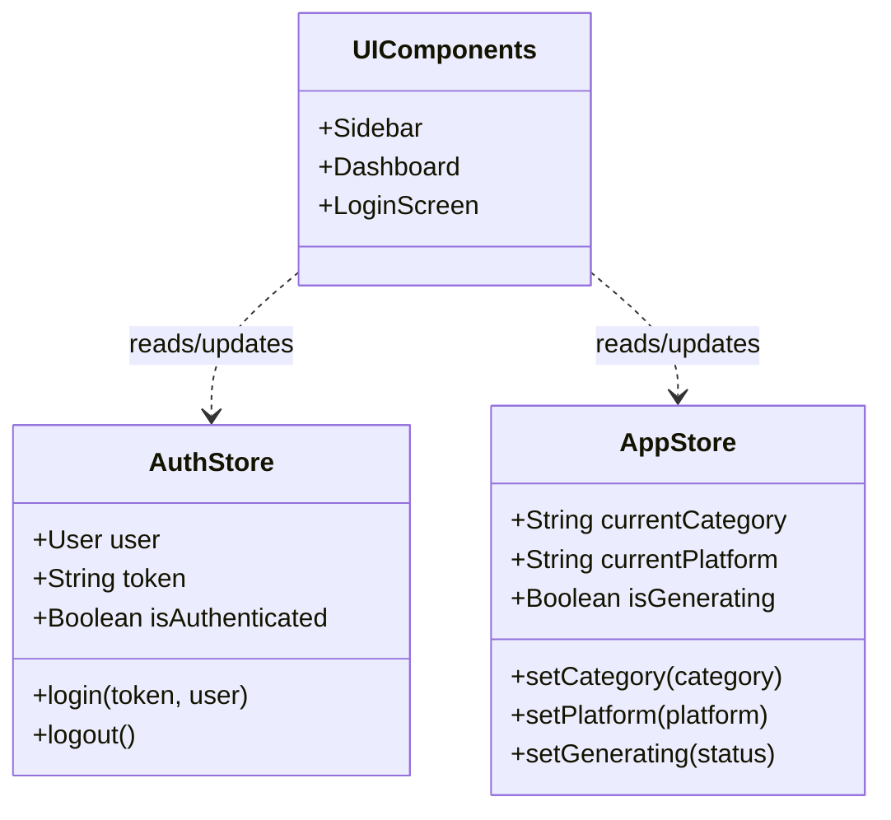

# Frontend State Management (Zustand)

Overview of how the Zustand stores are organized on the client.

```mermaid
classDiagram
    class AuthStore {
        +User user
        +String token
        +Boolean isAuthenticated
        +login(token, user)
        +logout()
    }
    
    class AppStore {
        +String currentCategory
        +String currentPlatform
        +Boolean isGenerating
        +setCategory(category)
        +setPlatform(platform)
        +setGenerating(status)
    }

    class UIComponents {
        +Sidebar
        +Dashboard
        +LoginScreen
    }

    UIComponents ..> AuthStore : reads/updates
    UIComponents ..> AppStore : reads/updates
```
