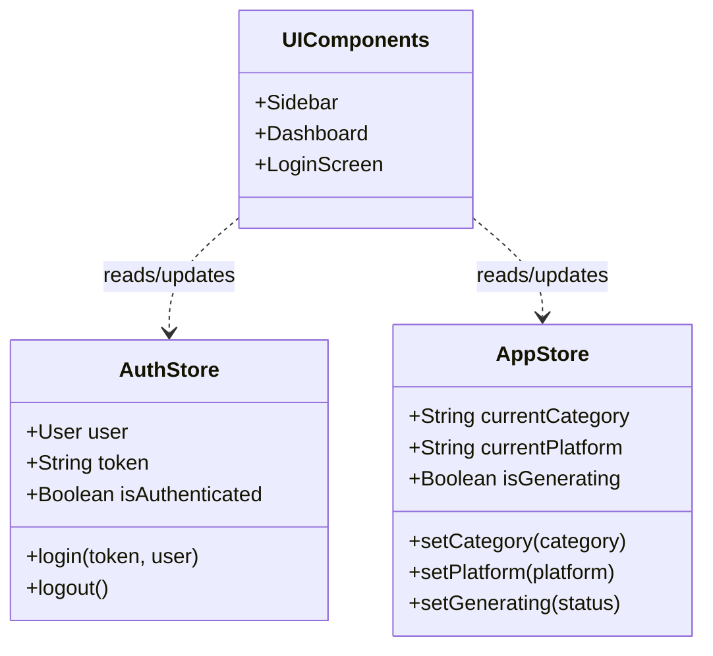

# Frontend State Management (Zustand)

## Overview
The React frontend uses Zustand for lightweight, fast, and scalable global state management.

## How it works:
- **AuthStore**: Manages user authentication state. It holds the JWT token and user profile. UI components read from this store to determine if they should redirect unauthenticated users to the login screen.
- **AppStore**: Manages UI state, such as the currently selected category for tech news, the chosen platform for content generation, and loading states (`isGenerating`).
- UI Components selectively subscribe to these stores to prevent unnecessary re-renders.

