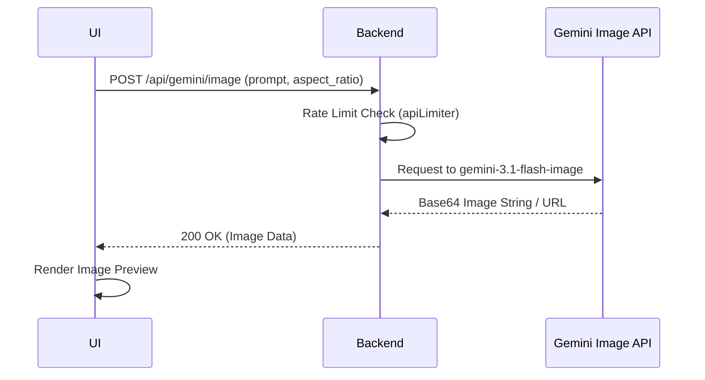

# Image Generation Flow

## Overview
The architecture of prompt-to-image capabilities using the Gemini API.

## How it works:
1. The user types a visual prompt and selects an aspect ratio on the frontend.
2. The backend receives the request and immediately checks the Rate Limiter to ensure the user isn't spamming the expensive image API.
3. The prompt is formatted and sent to `gemini-3.1-flash-image`.
4. The Gemini API returns a raw Base64 image string (or URL).
5. The backend forwards this string to the UI.
6. The UI parses the Base64 data into a viewable HTML `` tag, allowing the user to download the final image.

