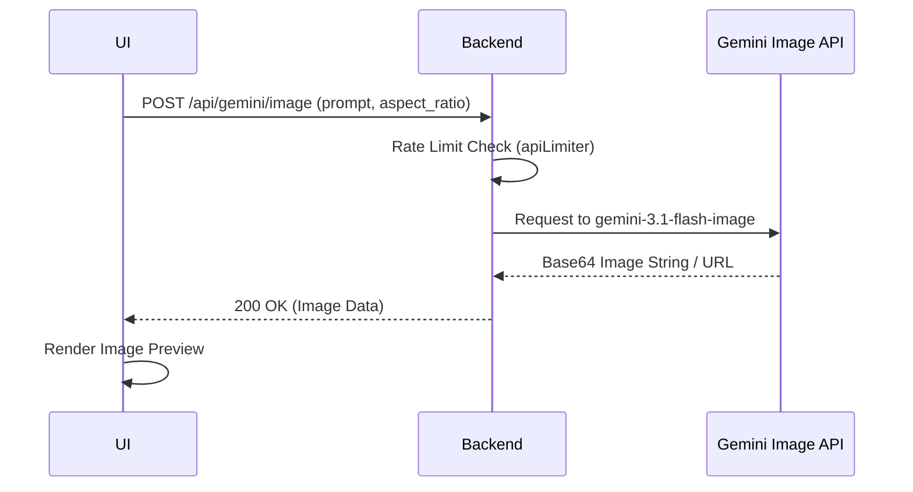

# Image Generation Flow

Using the Gemini Image Model for prompt-to-image capabilities.

```mermaid
sequenceDiagram
    participant UI
    participant Backend
    participant Gemini Image API
    
    UI->>Backend: POST /api/gemini/image (prompt, aspect_ratio)
    Backend->>Backend: Rate Limit Check (apiLimiter)
    Backend->>Gemini Image API: Request to gemini-3.1-flash-image
    Gemini Image API-->>Backend: Base64 Image String / URL
    Backend-->>UI: 200 OK (Image Data)
    UI->>UI: Render Image Preview
```
