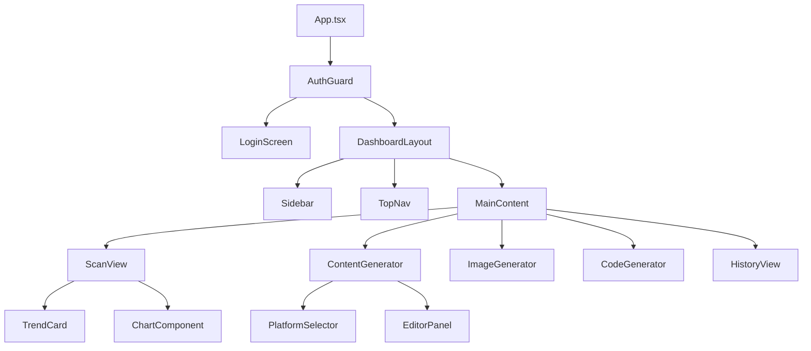

# React Component Hierarchy

Tree structure of the React Frontend application.

```mermaid
graph TD
    App[App.tsx] --> AuthGuard
    AuthGuard --> LoginScreen
    AuthGuard --> DashboardLayout
    
    DashboardLayout --> Sidebar
    DashboardLayout --> TopNav
    DashboardLayout --> MainContent
    
    MainContent --> ScanView
    MainContent --> ContentGenerator
    MainContent --> ImageGenerator
    MainContent --> CodeGenerator
    MainContent --> HistoryView
    
    ScanView --> TrendCard
    ScanView --> ChartComponent
    
    ContentGenerator --> PlatformSelector
    ContentGenerator --> EditorPanel
```
