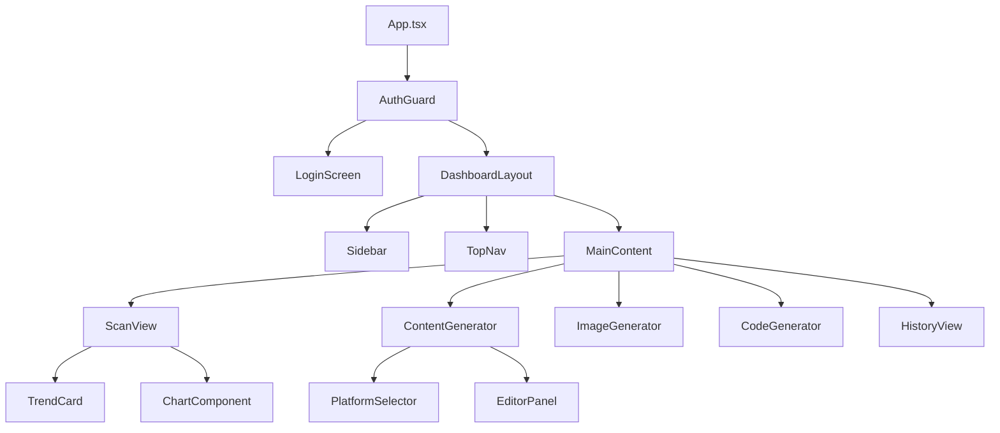

# React Component Hierarchy

## Overview
The tree structure of the React Frontend application, showcasing how components are nested.

## How it works:
- **App.tsx**: The root of the application. It wraps everything in an AuthGuard.
- **AuthGuard**: Checks if the user is logged in. If not, renders the `LoginScreen`. If yes, renders the `DashboardLayout`.
- **DashboardLayout**: A persistent wrapper containing the Sidebar navigation and Top Navigation bar.
- **MainContent**: The dynamic area of the screen where specific views (Scan, Content, Image, Code) are rendered based on the active React Router path.

