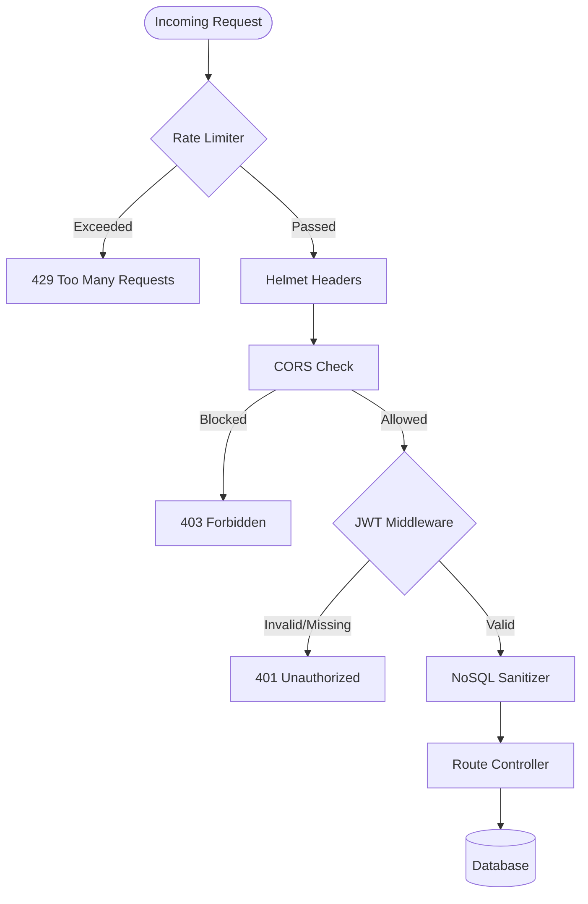

# Security Layers

Overview of backend security implementation.

```mermaid
flowchart TD
    Request([Incoming Request]) --> RateLimit{Rate Limiter}
    RateLimit -- Exceeded --> 429[429 Too Many Requests]
    RateLimit -- Passed --> Helmet[Helmet Headers]
    Helmet --> CORS[CORS Check]
    CORS -- Blocked --> 403[403 Forbidden]
    CORS -- Allowed --> Auth{JWT Middleware}
    
    Auth -- Invalid/Missing --> 401[401 Unauthorized]
    Auth -- Valid --> Sanitizer[NoSQL Sanitizer]
    
    Sanitizer --> Controller[Route Controller]
    Controller --> DB[(Database)]
```
