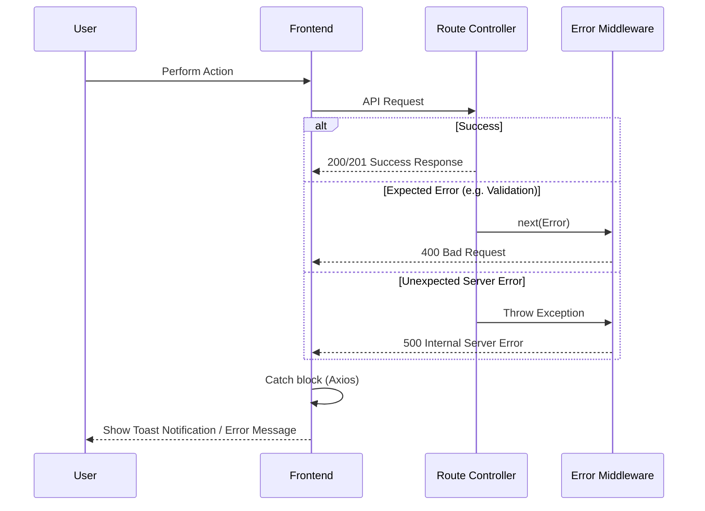

# Global Error Handling Flow

## Overview
How unexpected crashes and expected API errors are caught, formatted, and displayed to the user safely.

## How it works:
- **Backend Controller**: Tries to execute code. If it catches an error (e.g., Gemini API is down), it passes it to the `next(error)` middleware.
- **Error Middleware**: The Express global error handler catches all thrown errors. It hides sensitive stack traces in production, formats the error into a clean JSON object (`{ error: "Message" }`), and sends the appropriate HTTP status code.
- **Frontend Axios Catch**: The frontend receives the 4xx or 5xx code, translates the JSON message, and triggers a UI Toast notification (e.g., using Sonner or standard React state) so the user understands what went wrong.

