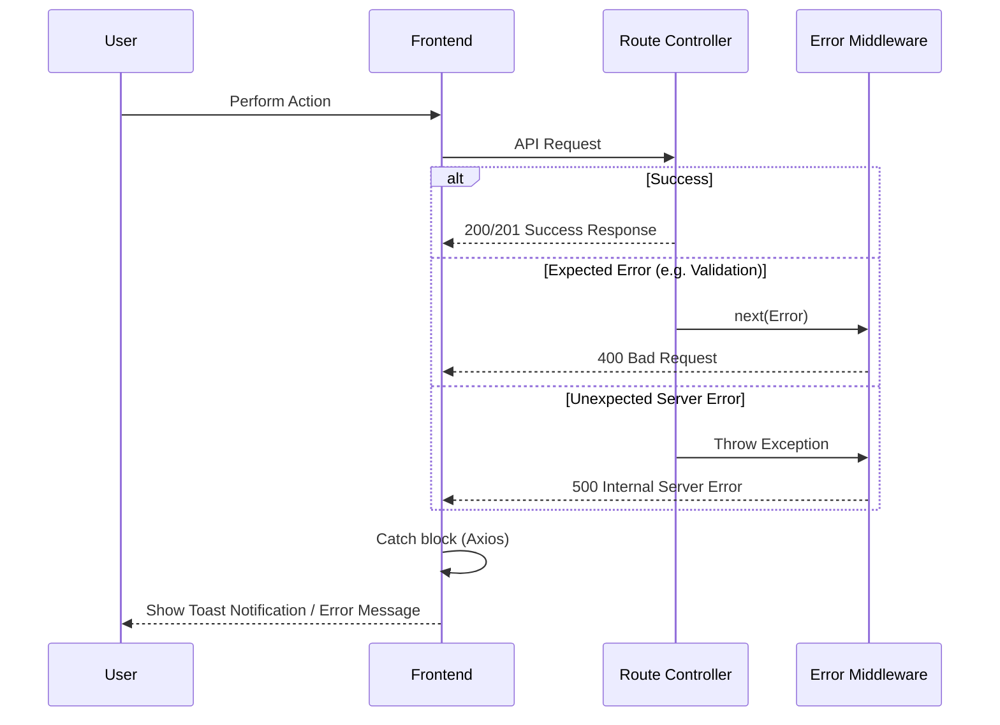

# Global Error Handling Flow

How errors are caught and processed across the stack.

```mermaid
sequenceDiagram
    participant User
    participant Frontend
    participant Route Controller
    participant Error Middleware
    
    User->>Frontend: Perform Action
    Frontend->>Route Controller: API Request
    
    alt Success
        Route Controller-->>Frontend: 200/201 Success Response
    else Expected Error (e.g. Validation)
        Route Controller->>Error Middleware: next(Error)
        Error Middleware-->>Frontend: 400 Bad Request
    else Unexpected Server Error
        Route Controller->>Error Middleware: Throw Exception
        Error Middleware-->>Frontend: 500 Internal Server Error
    end
    
    Frontend->>Frontend: Catch block (Axios)
    Frontend-->>User: Show Toast Notification / Error Message
```
