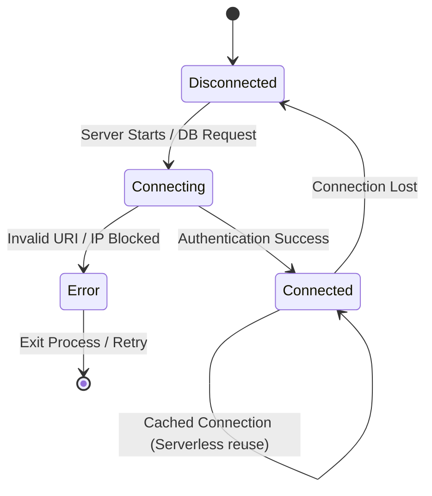

# Database Connection Lifecycle

Mongoose connection management, especially for Serverless environments.

```mermaid
stateDiagram-v2
    [*] --> Disconnected
    
    Disconnected --> Connecting : Server Starts / DB Request
    Connecting --> Connected : Authentication Success
    Connecting --> Error : Invalid URI / IP Blocked
    
    Connected --> Disconnected : Connection Lost
    Connected --> Connected : Cached Connection (Serverless reuse)
    
    Error --> [*] : Exit Process / Retry
```
