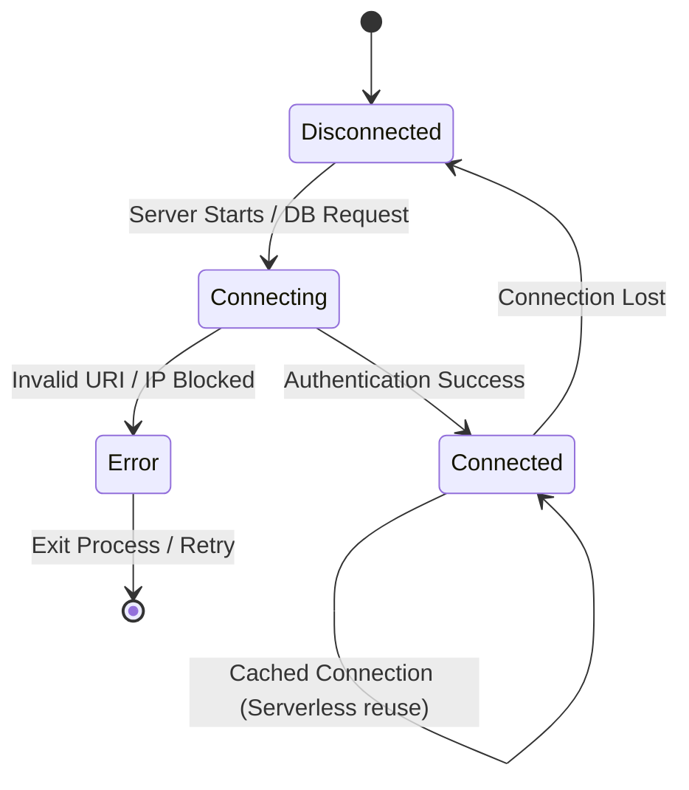

# Database Connection Lifecycle

## Overview
How Mongoose manages connections to MongoDB Atlas, specifically optimized to prevent connection leaks.

## How it works:
- When the Node.js server starts, it initializes a connection pool to MongoDB Atlas.
- For standard servers (like Render), this connection is kept alive (Connected state).
- If a network drop occurs, Mongoose automatically attempts reconnection.
- If the initial connection fails (e.g., bad IP whitelist or wrong password), the process logs a fatal error and can either gracefully exit or retry, ensuring the server doesn't hang indefinitely in a zombie state.

