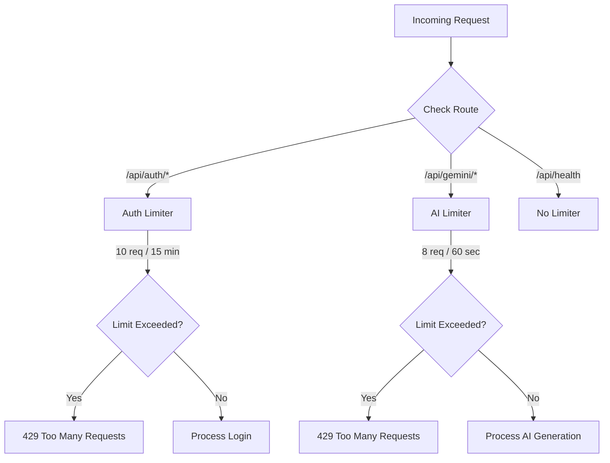

# Rate Limiting Architecture

## Overview
Protection mechanisms against API abuse, brute forcing, and excessive billing charges from external APIs.

## How it works:
- **Route Specificity**: Different routes have different rate limits. 
- **Auth Limiter**: The login route has a strict limit (e.g., 10 attempts per 15 minutes) to prevent hackers from guessing passwords (Brute Force).
- **AI Limiter**: The Gemini API routes have a moderate limit (e.g., 8 requests per minute) to ensure a single user doesn't exhaust the Google Cloud API quota.
- If a user exceeds a threshold, Express automatically blocks the IP and returns a `429 Too Many Requests` HTTP status until the time window resets.

