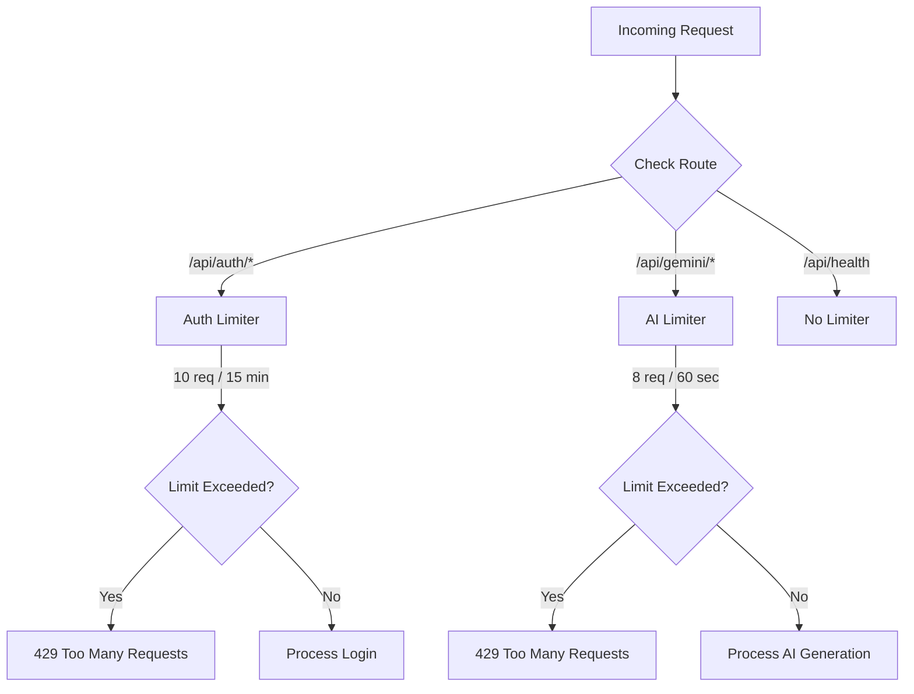

# Rate Limiting Architecture

Protection against abuse and excessive API calls.

```mermaid
graph TD
    IncomingRequest[Incoming Request] --> RouteCheck{Check Route}
    
    RouteCheck -->|/api/auth/*| AuthLimiter[Auth Limiter]
    RouteCheck -->|/api/gemini/*| AILimiter[AI Limiter]
    RouteCheck -->|/api/health| NoLimit[No Limiter]
    
    AuthLimiter -->|10 req / 15 min| AllowAuth{Limit Exceeded?}
    AILimiter -->|8 req / 60 sec| AllowAI{Limit Exceeded?}
    
    AllowAuth -->|Yes| Block1[429 Too Many Requests]
    AllowAuth -->|No| ProcessAuth[Process Login]
    
    AllowAI -->|Yes| Block2[429 Too Many Requests]
    AllowAI -->|No| ProcessAI[Process AI Generation]
```
