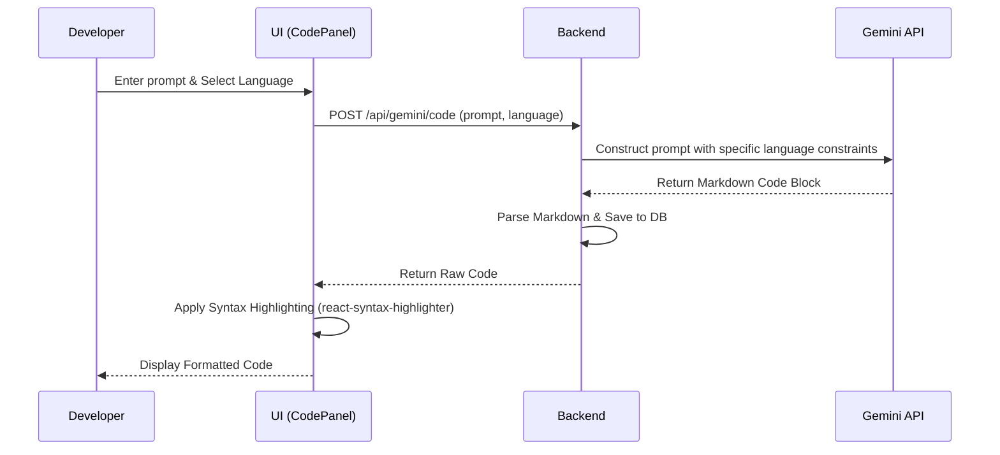

# Code Generation Flow

## Overview
Process of taking conversational user prompts and returning strict, syntax-highlighted programming code using Gemini.

## How it works:
1. The developer inputs a request (e.g., "Write a bubble sort function") and selects a target language (e.g., Python).
2. The backend receives this and wraps the user prompt in a strict system instruction (e.g., "You are an expert coder. Return ONLY valid Python code, no conversational text").
3. Gemini processes the prompt and returns a Markdown code block.
4. The backend cleans the response and saves it to the DB.
5. The frontend receives the raw string and uses a library like `react-syntax-highlighter` to parse the Markdown into beautiful, colored, readable code on the screen.

