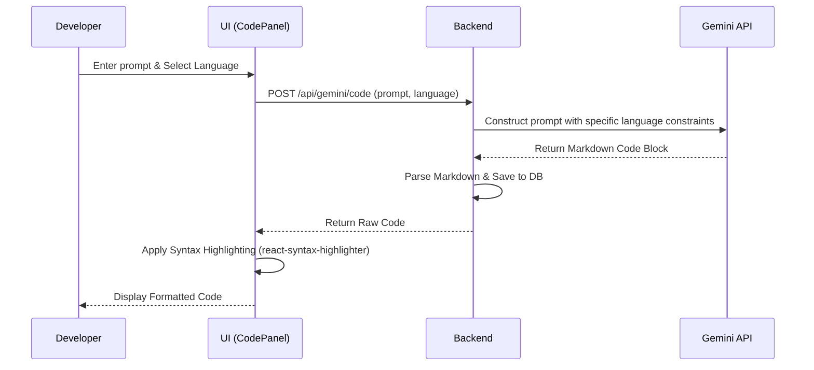

# Code Generation Flow

Process of taking user prompts and returning syntax-highlighted code.

```mermaid
sequenceDiagram
    participant Developer
    participant UI (CodePanel)
    participant Backend
    participant Gemini API
    
    Developer->>UI (CodePanel): Enter prompt & Select Language
    UI (CodePanel)->>Backend: POST /api/gemini/code (prompt, language)
    Backend->>Gemini API: Construct prompt with specific language constraints
    Gemini API-->>Backend: Return Markdown Code Block
    Backend->>Backend: Parse Markdown & Save to DB
    Backend-->>UI (CodePanel): Return Raw Code
    UI (CodePanel)->>UI (CodePanel): Apply Syntax Highlighting (react-syntax-highlighter)
    UI (CodePanel)-->>Developer: Display Formatted Code
```
